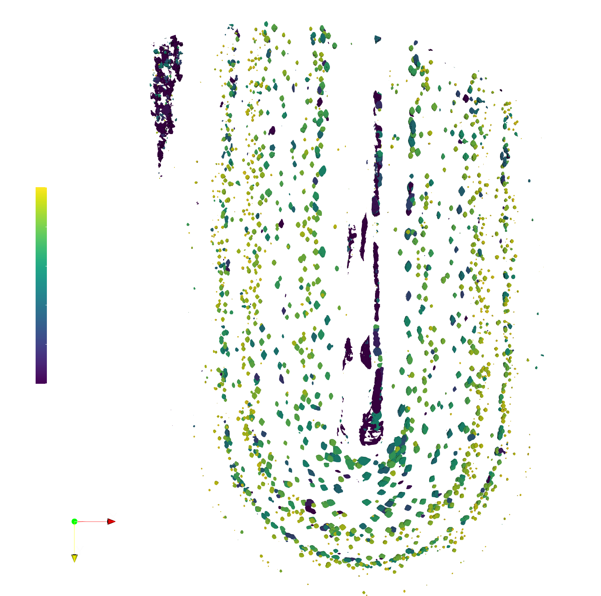
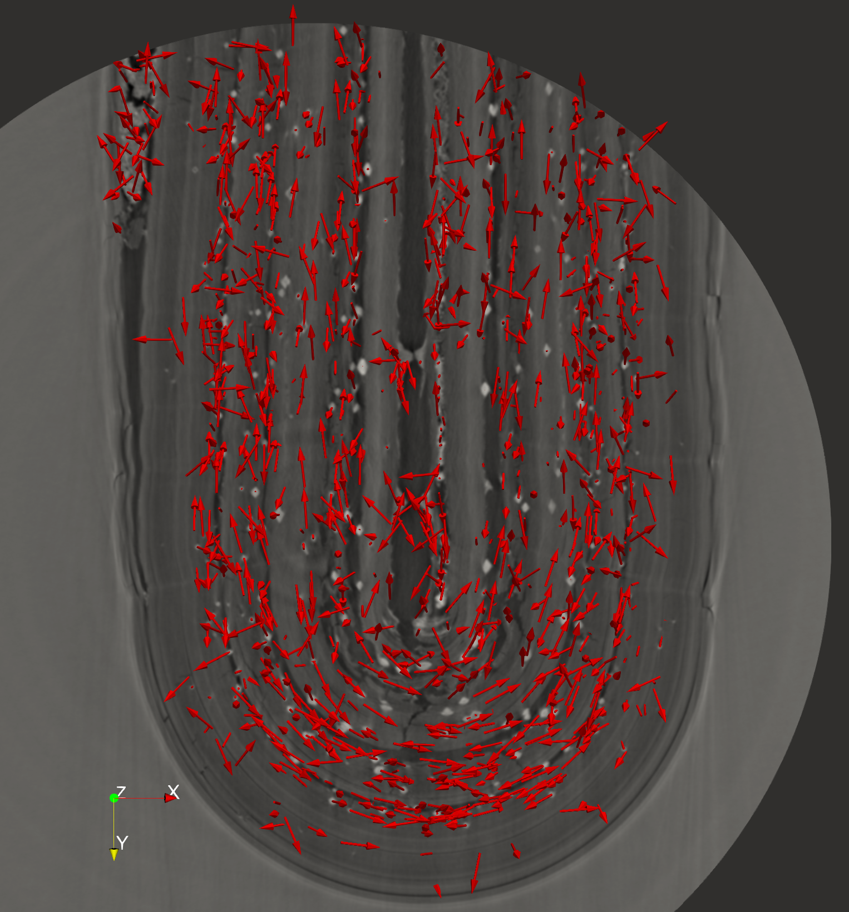

# 07-10/03/2022 - CERIC-Franceschin beamtime @ SYRMEP Elettra
- [Franceschin_log](https://docs.google.com/document/d/1fjyVFMCTpSvbUCNX24nXlbFs_4Q7dz0G9pO4Xdt3MnQ/edit?usp=sharing)
- [Franceschin_master](https://docs.google.com/spreadsheets/d/1Y38t_4FsvHDCTG1txvbf_1c687XsCP6WCiDtyZxWU_U/edit?usp=sharing)
- [Image processing notebooks](./notebooks)

particles sphericity | particles orientation
:-------------------------:|:-------------------------:
  |  

