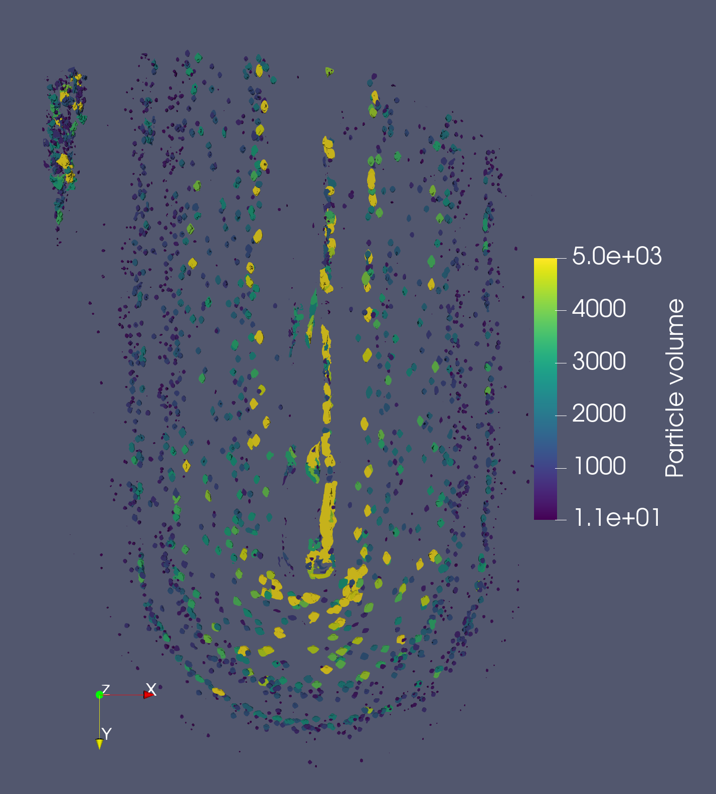
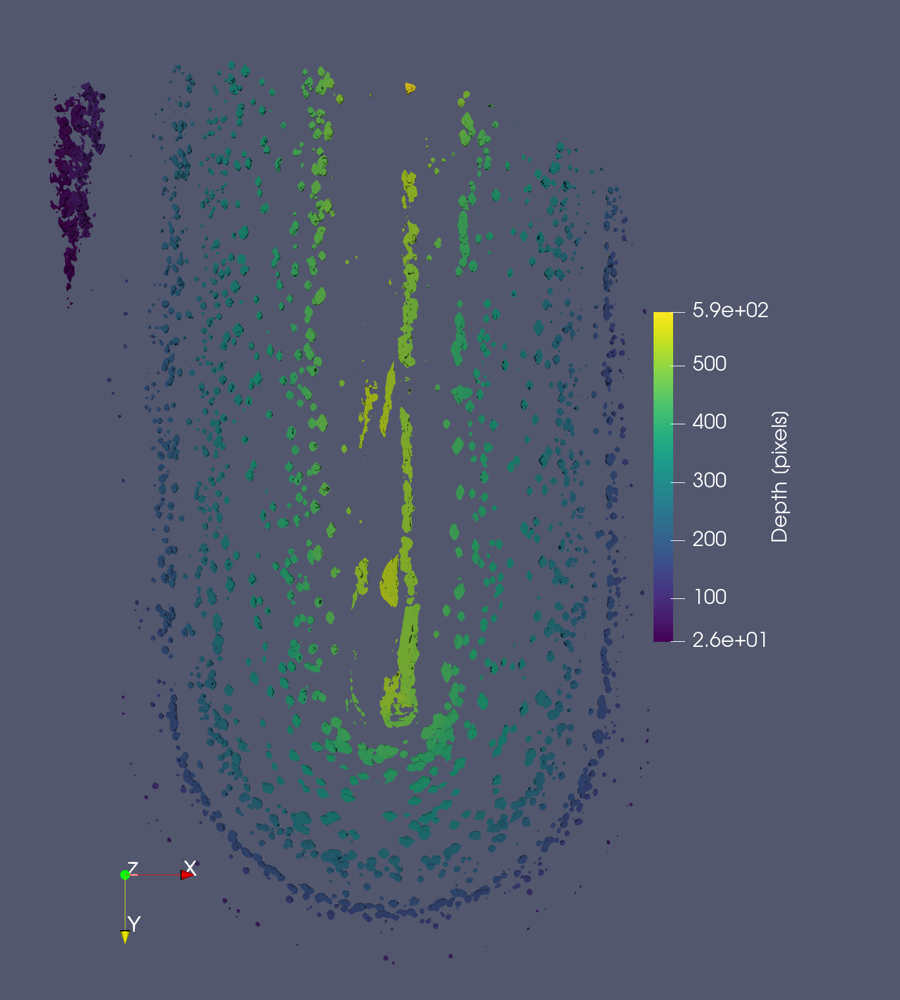

# 07-10/03/2022 - CERIC-Franceschin beamtime @ SYRMEP Elettra
Repository of the image processing software for G. Franceschin et al. "An Archaeological Fragment of Roman Glass Reveals the Patterns of Glass Corrosion Mechanisms in Soil."

Sample and data information:

|Scan parameters|   |
|:-|:-|
|Beamline|SYRMEP@Elettra|
|Beamtime|20217193_Traviglia - CERIC|
|Sample|581681_patina/581681_punta_HR_stitch2 |
|Energy| 27 keV |
|Camera| ORCA flash |
|Voxel size| 1.0 um |
|SDD | 150 mm |
|Preliminary operations|[stitch of 4 scans](https://github.com/gianthk/recon_utils/tree/master/stitch_scan) (normalized; 2D rigid transform) |

Image processing steps are described in the [Image processing notebooks](./notebooks) folder.

---
particle sphericity | particle orientation
:-------------------------:|:-------------------------:
  |  

particle volume | particle depth
:-------------------------:|:-------------------------:
  |  

## Figures
- [X] Particle location
- [X] Particle size and shape (sphericity, DA, ...)
- [X] Particles orientation

## To do
- [X] export vars to H5 file
- [X] fill plots (volume, DA, sphericity) VS dist from pit front

---
## Acknowledgements
We acknowledge the CERIC-ERIC Consortium for the access to experimental facility SYRMEP of ELETTRA and financial support for synchrotron measurements.  

The images published here are made available under the concession granted by the Ministry of Culture, Regional Directorate of Museums of Friuli Venezia Giulia, and are subject to specific conditions. Any further reproduction, duplication by any means, as well as downloading and subsequent manipulation, is strictly prohibited.

---
Beamtime files (restricted access):
- [Beamtime log](https://docs.google.com/document/d/1fjyVFMCTpSvbUCNX24nXlbFs_4Q7dz0G9pO4Xdt3MnQ/edit?usp=sharing)
- [Beamtime master file](https://docs.google.com/spreadsheets/d/1ZFOwhJzm3khHMlIqH4ead-EV-TQC7OiZ/edit?usp=sharing&ouid=110158396991829805042&rtpof=true&sd=true)

