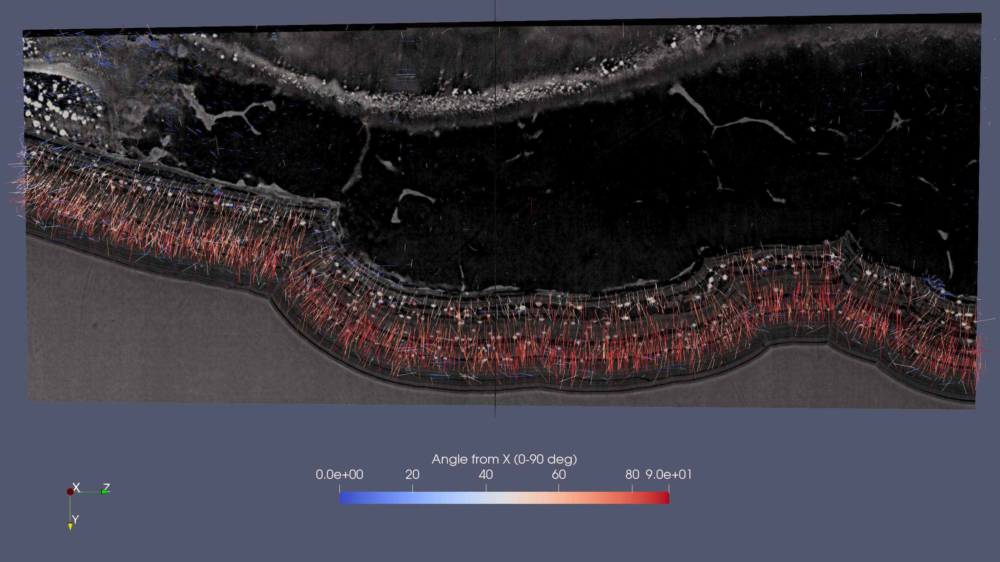

## Image processing notebooks
Image processing of CERIC synchrotron microCT beamtime *20217193_Traviglia* - ELETTRA SYRMEP
- By [Gianluca Iori](https://github.com/gianthk), Giulia Franceschin, Roberta Zanin, Elena Longo, 2023
- Code licence: MIT
- Narrative licence: CC-BY
- Created on:  22.04.2022
- Last update: 13.07.2023

#### Preliminary operations
The dataset is composed of a stitched 3D image of 4 synchrotron x-ray phase-contrast microCT scans obtained at ELETTRA SYRMEP. The stictching of 3D volumes was performed with the Python software [`recon_utils/stitch_scan`](https://github.com/gianthk/recon_utils/tree/master/stitch_scan).

---
### [581681_punta_HR_stitch2_masks.ipynb - binary masks generation](581681_punta_HR_stitch2_masks.ipynb) 

This notebook shows how to:
- [X] Generate binary mask of the whole corrosion pit 
- [X] Generate binary mask of the pit bottom
- [X] Generate binary mask of particle inclusions

---
### [581681_punta_HR_stitch2_particles.ipynb - analysis of particle inclusions](581681_punta_HR_stitch2_particles.ipynb) 

Use the `label toolkit` of the [spam](https://ttk.gricad-pages.univ-grenoble-alpes.fr/spam/spam_examples/label/plot_labelToolkit01.html) package to:

1. Label single particle sediments within the corrosion pit
2. Analyse properties of single particles such as their volume and sphericity
3. Study and generate plots of the orientation of single particles
4. Measure the distance of sedimented particles from the pit corrosion front (particle age)
5. Plot the relationship between particle age and morphology

---
### [581681_punta_HR_stitch2_plotting.ipynb - analysis of particle inclusions](581681_punta_HR_stitch2_plotting.ipynb) 

This notebook shows how to:
1. Particle localization
    - [X] particles / voids VS pit front
    - [X] hist distance from voids
2. Particle size and shape
    - [X] hist volume
    - [X] hist sphericity
    - [X] hist DA
    - [X] shell mesh single particle with symmetry plane and principal eigenvector (paraview)
3. Particle orientation
    - [X] orientation plot SPAM
